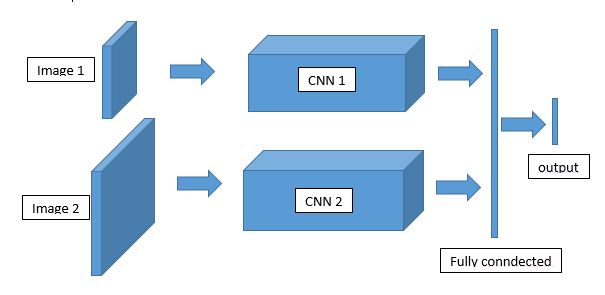
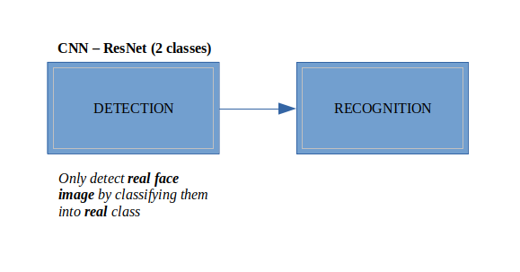

# High Quality Deep Face
In order to solve the problem for the face recognition can't identify the human real faces and photos of human . Proposer is proposing new deep learning architecture model combination which requires to optimize face detection process and is able to recognize those valuable images.

## Convolutional Neural Network 
The traditional neural network (CNN) is very popular with many topics such as image processing, image classification,... Because of that power, the proposer wants to apply the technique of CNN for cutting image part and also using [Caffe-DL](https://caffe.berkeleyvision.org/) for reconstructing the platform prediction

  

## Technique Details
* The inspired idea comes from Andrew Ng Baidu Face-recognition enabled entrance [demo](https://youtu.be/wr4rx0Spihs)
* Problem can be solved by training a new CNN model for only detection but actually recognizing technique between 2 classes (fake-real). 
* The different of fake and real features are belong to the image data. Those fakes image can't compare (the size, space and landscape,...) with real image.

  

## Data-model

* Data has been collected from the internet by Adrian at PyImageSearch
* Model has been trained using power of Google Colab Server
* The result has been stored into json and HDF5 format on Google Drive and can be accessed in [here](https://drive.google.com/drive/u/0/folders/1uvDduzWXzt87VxBjPWFI3fDKakb_ZsIX)

